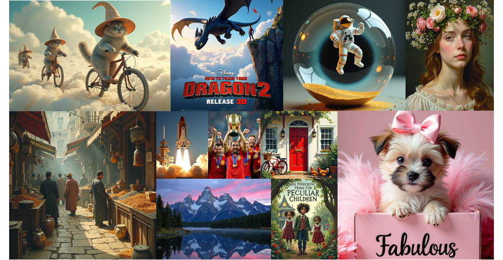

<div align="center">

# PRISM Benchmark & FLUX-Reason-6M Dataset

[[🌐 Homepage](https://flux-reason-6m.github.io/)] [[🤗 Huggingface Dataset](https://huggingface.co/datasets/LucasFang/FLUX-Reason-6M)] [[📊 Leaderboard ](https://flux-reason-6m.github.io/#leaderboard)] [[📊 Leaderboard-ZH ](https://flux-reason-6m.github.io/#leaderboard)] [[📖 Paper](https://arxiv.org/pdf/2509.09680)]

[Rongyao Fang](https://rongyaofang.github.io/)<sup>1*</sup>&ensp; [Aldrich Yu](https://aldrichyu.github.io/)<sup>1*</sup>&ensp; [Chengqi Duan](https://scholar.google.com/citations?user=r9qb4ZwAAAAJ&hl=en)<sup>2*</sup>&ensp; [Linjiang Huang](https://leonhlj.github.io/)<sup>3</sup>&ensp; [Shuai Bai](https://scholar.google.com/citations?user=ylhI1JsAAAAJ&hl=zh-CN)<sup>4</sup>&ensp; 

[Yuxuan Cai](https://scholar.google.com/citations?user=EzYiBeUAAAAJ&hl=en)<sup>4</sup>&ensp; [Kun Wang](https://openreview.net/profile?id=~Kun_Wang8)<sup>5</sup>&ensp; [Si Liu](https://scholar.google.com/citations?user=-QtVtNEAAAAJ&hl=en)<sup>3</sup>&ensp; [Xihui Liu](https://xh-liu.github.io/)<sup>2†</sup>&ensp; [Hongsheng Li](https://www.ee.cuhk.edu.hk/~hsli/)<sup>1†</sup>&ensp;

<sup>1</sup>CUHK&ensp;&ensp; <sup>2</sup>HKU&ensp;&ensp; <sup>3</sup>BUAA&ensp;&ensp; <sup>4</sup>Alibaba&ensp;&ensp; <sup>5</sup>Sensetime&ensp;&ensp; 

<sup>*</sup>Equal Contribution&ensp; <sup>†</sup>Corresponding Author

</div>

## 📖 Introduction

🌟  This is the official repository for the paper "[FLUX-Reason-6M & PRISM-Bench: A Million-Scale Text-to-Image Reasoning Dataset and Comprehensive Benchmark](https://flux-reason-6m.github.io/)", which contains both evaluation code and data for the **PRISM Benchmark**.

<p align="center">
  
</p>

We introduce **FLUX-Reason-6M** and **PRISM-Bench**. FLUX-Reason-6M is a **6-million-scale** synthesized dataset designed to incorporate reasoning capabilities into the architecture of T2I generation. PRISM-Bench serves as a comprehensive and discriminative benchmark with **7 independent tracks** that closely align with human judgment.

## 💥 News
- **[2026-01-26]** 🎉 Our paper has been accepted to **ICLR 2026**!
- **[2025-09-12]** Our FLUX-Reason-6M dataset is now accessible at [huggingface](https://huggingface.co/datasets/LucasFang/FLUX-Reason-6M).
- **[2025-09-12]** Our paper is now accessible at [ArXiv Paper](https://arxiv.org/abs/2509.09680).

## 📈 Evaluation

### Data
Please organize the image data as follows.
```sh
└── images
│   ├── imagination
│   │   ├── 0.png
│   │   ├── 1.png
│   │   ├── ...
│   │   ├── 99.png
│   ├── entity
│   ├── text_rendering
│   ├── style
│   ├── affection
│   ├── composition
│   ├── long_text
```

### PRISM-Bench Evaluation

#### Eval with GPT4.1:

```sh
python evaluation/eval_gpt41.py --image_path <path to image data> --api_key <OpenAI API key> --base_url <OpenAI base URL for custom or proxy endpoints>
```
#### Eval with Qwen2.5-VL-72B:
```sh
python evaluation/eval_qwen25.py --image_path <path to image data> --model_path <path to qwen model> --output_dir <path to save results>
```

### PRISM-Bench-ZH Evaluation

#### Eval with GPT4.1:

```sh
python evaluation/eval_gpt41.py --image_path <path to image data> --api_key <OpenAI API key> --base_url <OpenAI base URL for custom or proxy endpoints> --zh
```
#### Eval with Qwen2.5-VL-72B:
```sh
python evaluation/eval_qwen25.py --image_path <path to image data> --model_path <path to qwen model> --output_dir <path to save results> --zh
```

## 📊 Benchmark
The leaderboard is available [here](https://flux-reason-6m.github.io/#leaderboard).

<details open>
<summary> PRISM-Bench(GPT4.1) </summary>

| # | Model | Source | Date | Overall (Align) | Overall (Aes) | Overall (Avg) | Imagination (Align) | Imagination (Aes) | Imagination (Avg) | Entity (Align) | Entity (Aes) | Entity (Avg) | Text rendering (Align) | Text rendering (Aes) | Text rendering (Avg) | Style (Align) | Style (Aes) | Style (Avg) | Affection (Align) | Affection (Aes) | Affection (Avg) | Composition (Align) | Composition (Aes) | Composition (Avg) | Long text (Align) | Long text (Aes) | Long text (Avg) |
|---|---|---|---|---|---|---|---|---|---|---|---|---|---|---|---|---|---|---|---|---|---|---|---|---|---|---|---|
| 1 | GPT-Image-1 [High] 🥇 | [Link](https://platform.openai.com/docs/guides/image-generation?image-generation-model=gpt-image-1) | 2025-09-10 | 86.9 | 85.6 | **86.3** | 86.2 | 86.6 | 86.4 | 90.0 | 86.3 | 88.2 | 68.8 | 80.1 | 74.5 | 92.8 | 93.3 | 93.1 | 90.7 | 90.9 | 90.8 | 96.2 | 89.4 | 92.8 | 83.8 | 72.8 | 78.3 |
| 2 | Gemini2.5-Flash-Image 🥈 | [Link](https://deepmind.google/models/gemini/image/) | 2025-09-10 | 87.1 | 83.4 | **85.3** | 92.4 | 84.8 | 88.6 | 87.0 | 81.3 | 84.2 | 65.2 | 74.1 | 69.7 | 90.5 | 90.8 | 90.7 | 96.0 | 88.2 | 92.1 | 92.5 | 88.5 | 90.5 | 85.9 | 76.2 | 81.1 |
| 3 | Qwen-Image 🥉 | [Link](https://huggingface.co/Qwen/Qwen-Image) | 2025-09-10 | 81.1 | 78.6 | **79.9** | 80.5 | 78.6 | 79.6 | 79.3 | 73.2 | 76.3 | 54.3 | 68.9 | 61.6 | 84.5 | 88.7 | 86.6 | 91.6 | 89.1 | 90.4 | 93.7 | 86.9 | 90.3 | 83.8 | 65.1 | 74.5 |
| 4 | SEEDream 3.0 | [Link](https://seed.bytedance.com/zh/tech/seedream3_0) | 2025-09-10 | 80.5 | 78.7 | **79.6** | 77.3 | 76.4 | 76.9 | 80.2 | 73.8 | 77.0 | 56.1 | 70.2 | 63.2 | 83.9 | 87.4 | 85.7 | 89.3 | 90.3 | 89.8 | 93.3 | 86.3 | 89.8 | 83.2 | 66.7 | 75.0 |
| 5 | HiDream-I1-Full | [Link](https://huggingface.co/HiDream-ai/HiDream-I1-Full) | 2025-09-10 | 76.1 | 75.6 | **75.9** | 74.4 | 75.6 | 75.0 | 74.4 | 72.4 | 73.4 | 58.2 | 70.4 | 64.3 | 81.4 | 84.8 | 83.1 | 90.1 | 88.8 | 89.5 | 90.1 | 85.4 | 87.8 | 63.8 | 52.0 | 57.9 |
| 6 | FLUX.1-Krea-dev | [Link](https://huggingface.co/black-forest-labs/FLUX.1-Krea-dev) | 2025-09-10 | 74.3 | 75.1 | **74.7** | 71.5 | 73.0 | 72.3 | 69.5 | 67.5 | 68.5 | 47.5 | 61.3 | 54.4 | 80.8 | 83.5 | 82.2 | 84.0 | 90.3 | 87.2 | 90.9 | 85.8 | 88.4 | 76.2 | 64.1 | 70.2 |
| 7 | FLUX.1-dev | [Link](https://huggingface.co/black-forest-labs/FLUX.1-dev) | 2025-09-10 | 72.4 | 74.9 | **73.7** | 68.1 | 74.0 | 71.1 | 70.7 | 71.2 | 71.0 | 48.1 | 64.5 | 56.3 | 72.3 | 80.5 | 76.4 | 88.3 | 91.1 | 89.7 | 89.0 | 84.6 | 86.8 | 70.6 | 58.5 | 64.6 |
| 8 | SD3.5-Large | [Link](https://huggingface.co/stabilityai/stable-diffusion-3.5-large) | 2025-09-10 | 73.9 | 73.5 | **73.7** | 73.3 | 71.2 | 72.3 | 76.7 | 71.9 | 74.3 | 52.0 | 65.8 | 58.9 | 77.1 | 84.2 | 80.7 | 87.1 | 85.2 | 86.2 | 87.0 | 84.7 | 85.9 | 64.3 | 51.7 | 58.0 |
| 9 | HiDream-I1-Dev | [Link](https://huggingface.co/HiDream-ai/HiDream-I1-Dev) | 2025-09-10 | 70.3 | 70.0 | **70.2** | 68.2 | 69.7 | 69.0 | 72.0 | 67.0 | 69.5 | 53.4 | 64.1 | 58.8 | 68.7 | 78.6 | 73.7 | 84.2 | 83.1 | 83.7 | 87.6 | 79.8 | 83.7 | 58.1 | 47.5 | 52.8 |
| 10 | SD3.5-Medium | [Link](https://huggingface.co/stabilityai/stable-diffusion-3.5-medium) | 2025-09-10 | 70.1 | 68.9 | **69.5** | 69.5 | 73.0 | 71.3 | 72.8 | 63.7 | 68.3 | 33.3 | 50.1 | 41.7 | 77.4 | 80.3 | 78.9 | 84.9 | 85.5 | 85.2 | 89.4 | 79.2 | 84.3 | 63.3 | 50.5 | 56.9 |
| 11 | SD3-Medium | [Link](https://huggingface.co/stabilityai/stable-diffusion-3-medium) | 2025-09-10 | 65.6 | 65.2 | **65.4** | 61.0 | 65.6 | 63.3 | 64.8 | 56.3 | 60.6 | 32.8 | 53.1 | 43.0 | 74.8 | 75.6 | 75.2 | 78.7 | 80.3 | 79.5 | 85.5 | 79.1 | 82.3 | 61.5 | 46.1 | 53.8 |
| 12 | Bagel-CoT | [Link](https://github.com/ByteDance-Seed/Bagel) | 2025-09-10 | 65.4 | 65.0 | **65.2** | 68.4 | 74.2 | 71.3 | 62.4 | 60.0 | 61.2 | 23.2 | 40.1 | 31.7 | 64.4 | 70.1 | 67.3 | 87.1 | 80.5 | 83.8 | 88.5 | 77.9 | 83.2 | 64.0 | 52.0 | 58.0 |
| 13 | Bagel | [Link](https://github.com/ByteDance-Seed/Bagel) | 2025-09-10 | 66.7 | 63.4 | **65.1** | 69.4 | 68.0 | 68.7 | 59.0 | 50.1 | 54.6 | 30.2 | 44.5 | 37.4 | 67.9 | 71.3 | 69.6 | 81.7 | 81.4 | 81.6 | 90.5 | 73.1 | 81.8 | 68.1 | 55.3 | 61.7 |
| 14 | FLUX.1-schnell | [Link](https://huggingface.co/black-forest-labs/FLUX.1-schnell) | 2025-09-10 | 67.1 | 61.2 | **64.2** | 63.3 | 66.2 | 64.8 | 61.8 | 51.2 | 56.5 | 46.2 | 54.1 | 50.2 | 68.6 | 70.1 | 69.4 | 75.4 | 69.9 | 72.7 | 85.1 | 67.5 | 76.3 | 69.4 | 49.7 | 59.6 |
| 15 | Playground | [Link](https://huggingface.co/playgroundai/playground-v2.5-1024px-aesthetic) | 2025-09-10 | 62.6 | 65.6 | **64.1** | 62.3 | 70.6 | 66.5 | 72.5 | 69.1 | 70.8 | 10.4 | 37.3 | 23.9 | 77.3 | 80.9 | 79.1 | 91.8 | 83.8 | 87.8 | 77.5 | 76.5 | 77.0 | 46.7 | 41.0 | 43.9 |
| 16 | JanusPro-7B | [Link](https://huggingface.co/deepseek-ai/Janus-Pro-7B) | 2025-09-10 | 64.2 | 57.2 | **60.7** | 70.4 | 65.8 | 68.1 | 67.1 | 51.9 | 59.5 | 15.5 | 36.7 | 26.1 | 71.4 | 73.8 | 72.6 | 79.2 | 71.5 | 75.4 | 83.7 | 61.0 | 72.4 | 62.4 | 39.7 | 51.1 |
| 17 | SDXL | [Link](https://huggingface.co/stabilityai/stable-diffusion-xl-base-1.0) | 2025-09-10 | 58.9 | 61.8 | **60.4** | 55.3 | 61.1 | 58.2 | 72.5 | 67.4 | 70.0 | 13.8 | 37.0 | 25.4 | 72.4 | 75.4 | 73.9 | 78.9 | 77.1 | 78.0 | 75.5 | 75.3 | 75.4 | 44.2 | 39.6 | 41.9 |
| 18 | SD2.1 | [Link](https://huggingface.co/stabilityai/stable-diffusion-2-1) | 2025-09-10 | 50.7 | 45.3 | **48.0** | 47.9 | 41.2 | 44.6 | 60.9 | 46.7 | 53.8 | 11.2 | 30.6 | 20.9 | 62.7 | 58.6 | 60.7 | 66.7 | 58.5 | 62.6 | 65.7 | 53.1 | 59.4 | 40.1 | 28.2 | 34.2 |
| 19 | SD1.5 | [Link](https://huggingface.co/stable-diffusion-v1-5/stable-diffusion-v1-5) | 2025-09-10 | 44.9 | 43.5 | **44.2** | 36.6 | 36.1 | 36.4 | 53.8 | 41.1 | 47.5 | 8.0 | 33.1 | 20.6 | 55.3 | 55.3 | 55.3 | 64.4 | 57.5 | 61.0 | 61.1 | 51.0 | 56.1 | 35.3 | 30.4 | 32.9 |

</details>

<details open>
<summary> PRISM-Bench (Qwen2.5-VL) </summary>

| # | Model | Source | Date | Overall (Align) | Overall (Aes) | Overall (Avg) | Imagination (Align) | Imagination (Aes) | Imagination (Avg) | Entity (Align) | Entity (Aes) | Entity (Avg) | Text rendering (Align) | Text rendering (Aes) | Text rendering (Avg) | Style (Align) | Style (Aes) | Style (Avg) | Affection (Align) | Affection (Aes) | Affection (Avg) | Composition (Align) | Composition (Aes) | Composition (Avg) | Long text (Align) | Long text (Aes) | Long text (Avg) |
|---|---|---|---|---|---|---|---|---|---|---|---|---|---|---|---|---|---|---|---|---|---|---|---|---|---|---|---|
| 1 | GPT-Image-1 [High] 🥇 | [Link](https://platform.openai.com/docs/guides/image-generation?image-generation-model=gpt-image-1) | 2025-09-10 | 82.7 | 78.7 | **80.7** | 79.8 | 53.3 | 66.6 | 87.3 | 81.0 | 84.1 | 66.7 | 86.8 | 76.8 | 87.3 | 87.8 | 87.5 | 88.1 | 79.8 | 84.0 | 92.2 | 84.9 | 88.5 | 77.2 | 77.5 | 77.4 |
| 2 | Gemini2.5-Flash-Image 🥈 | [Link](https://deepmind.google/models/gemini/image/) | 2025-09-10 | 85.0 | 75.8 | **80.4** | 84.7 | 38.1 | 61.4 | 86.0 | 76.7 | 81.3 | 72.8 | 84.3 | 78.5 | 89.5 | 87.8 | 88.6 | 94.3 | 74.8 | 84.5 | 91.2 | 88.2 | 89.7 | 76.3 | 80.6 | 78.4 |
| 3 | SEEDream 3.0 🥉 | [Link](https://seed.bytedance.com/zh/tech/seedream3_0) | 2025-09-10 | 80.1 | 72.3 | **76.2** | 75.8 | 38.0 | 56.9 | 81.3 | 74.2 | 77.7 | 58.8 | 74.0 | 66.4 | 84.4 | 84.1 | 84.2 | 90.5 | 74.6 | 82.5 | 93.6 | 85.1 | 89.3 | 76.2 | 76.4 | 76.3 |
| 4 | Qwen-Image | [Link](https://huggingface.co/Qwen/Qwen-Image) | 2025-09-10 | 80.0 | 68.3 | **74.1** | 75.5 | 37.4 | 56.5 | 79.5 | 64.5 | 72.0 | 57.9 | 71.2 | 64.5 | 86.6 | 84.4 | 85.5 | 89.9 | 70.4 | 80.1 | 93.9 | 79.5 | 86.7 | 76.8 | 70.9 | 73.8 |
| 5 | FLUX.1-Krea-dev | [Link](https://huggingface.co/black-forest-labs/FLUX.1-Krea-dev) | 2025-09-10 | 74.4 | 73.7 | **74.0** | 69.6 | 43.1 | 56.3 | 72.2 | 70.7 | 71.4 | 51.7 | 76.1 | 63.9 | 80.0 | 86.6 | 83.3 | 82.6 | 78.7 | 80.6 | 90.8 | 87.1 | 88.9 | 73.6 | 73.4 | 73.5 |
| 6 | HiDream-I1-Full | [Link](https://huggingface.co/HiDream-ai/HiDream-I1-Full) | 2025-09-10 | 76.6 | 68.6 | **72.6** | 73.0 | 44.0 | 58.5 | 76.3 | 72.8 | 74.5 | 60.5 | 76.4 | 68.4 | 81.4 | 81.5 | 81.4 | 90.0 | 76.6 | 83.3 | 88.5 | 80.3 | 84.4 | 66.3 | 48.6 | 57.4 |
| 7 | SD3.5-Large | [Link](https://huggingface.co/stabilityai/stable-diffusion-3.5-large) | 2025-09-10 | 73.4 | 67.8 | **70.6** | 66.7 | 43.4 | 55.0 | 76.8 | 72.7 | 74.8 | 53.6 | 73.1 | 63.3 | 77.3 | 78.2 | 77.7 | 85.6 | 73.9 | 79.7 | 87.8 | 80.9 | 84.3 | 65.8 | 52.2 | 59.0 |
| 8 | HiDream-I1-Dev | [Link](https://huggingface.co/HiDream-ai/HiDream-I1-Dev) | 2025-09-10 | 72.3 | 67.0 | **69.6** | 68.8 | 45.8 | 57.3 | 73.5 | 68.1 | 70.8 | 56.7 | 75.7 | 66.2 | 70.2 | 77.4 | 73.8 | 88.2 | 74.3 | 81.2 | 84.7 | 78.5 | 81.6 | 64.0 | 49.3 | 56.6 |
| 9 | FLUX.1-dev | [Link](https://huggingface.co/black-forest-labs/FLUX.1-dev) | 2025-09-10 | 72.1 | 64.9 | **68.5** | 65.5 | 42.9 | 54.2 | 70.6 | 61.9 | 66.2 | 52.3 | 73.0 | 62.6 | 72.6 | 74.2 | 73.4 | 86.0 | 72.9 | 79.4 | 87.4 | 75.8 | 81.6 | 70.5 | 53.8 | 62.1 |
| 10 | SD3.5-Medium | [Link](https://huggingface.co/stabilityai/stable-diffusion-3.5-medium) | 2025-09-10 | 68.6 | 65.1 | **66.8** | 65.1 | 34.7 | 49.9 | 72.5 | 70.9 | 71.7 | 36.6 | 64.5 | 50.5 | 75.5 | 80.0 | 77.7 | 81.8 | 73.9 | 77.9 | 85.4 | 81.0 | 83.2 | 63.5 | 50.6 | 57.0 |
| 11 | SD3-Medium | [Link](https://huggingface.co/stabilityai/stable-diffusion-3-medium) | 2025-09-10 | 68.0 | 64.2 | **66.1** | 64.3 | 37.7 | 51.0 | 69.4 | 63.3 | 66.3 | 38.5 | 63.3 | 50.9 | 74.6 | 79.5 | 77.0 | 80.5 | 75.5 | 78.0 | 85.6 | 79.5 | 82.5 | 63.4 | 50.3 | 56.8 |
| 12 | FLUX.1-schnell | [Link](https://huggingface.co/black-forest-labs/FLUX.1-schnell) | 2025-09-10 | 68.3 | 61.1 | **64.7** | 62.8 | 35.6 | 49.2 | 64.8 | 56.8 | 60.8 | 54.3 | 68.1 | 61.2 | 70.3 | 71.5 | 70.9 | 75.4 | 65.9 | 70.6 | 81.7 | 75.6 | 78.6 | 68.7 | 54.4 | 61.5 |
| 13 | JanusPro-7B | [Link](https://huggingface.co/deepseek-ai/Janus-Pro-7B) | 2025-09-10 | 64.9 | 59.4 | **62.1** | 65.0 | 38.8 | 51.9 | 68.6 | 63.5 | 66.0 | 23.1 | 50.3 | 36.7 | 70.7 | 75.2 | 72.9 | 80.7 | 68.0 | 74.3 | 82.4 | 71.1 | 76.7 | 63.9 | 49.0 | 56.4 |
| 14 | Bagel-CoT | [Link](https://github.com/ByteDance-Seed/Bagel) | 2025-09-10 | 67.5 | 56.5 | **62.0** | 68.0 | 44.1 | 56.0 | 67.6 | 53.4 | 60.5 | 29.4 | 42.3 | 35.8 | 69.0 | 69.7 | 69.3 | 87.1 | 66.7 | 76.9 | 86.6 | 69.2 | 77.9 | 64.5 | 50.2 | 57.3 |
| 15 | Bagel | [Link](https://github.com/ByteDance-Seed/Bagel) | 2025-09-10 | 67.5 | 56.6 | **62.0** | 68.0 | 45.0 | 56.5 | 67.6 | 53.4 | 60.5 | 29.4 | 42.3 | 35.8 | 69.0 | 69.7 | 69.3 | 87.1 | 66.7 | 76.9 | 86.6 | 69.2 | 77.9 | 64.5 | 50.2 | 57.3 |
| 16 | Playground | [Link](https://huggingface.co/playgroundai/playground-v2.5-1024px-aesthetic) | 2025-09-10 | 62.2 | 52.1 | **57.1** | 59.0 | 39.0 | 49.0 | 69.4 | 56.7 | 63.0 | 15.3 | 31.9 | 23.6 | 74.6 | 74.6 | 74.6 | 88.8 | 66.0 | 77.4 | 72.2 | 61.3 | 66.7 | 56.0 | 35.3 | 45.6 |
| 17 | SDXL | [Link](https://huggingface.co/stabilityai/stable-diffusion-xl-base-1.0) | 2025-09-10 | 60.1 | 54.0 | **57.0** | 54.5 | 34.1 | 44.3 | 71.1 | 65.0 | 68.0 | 18.6 | 37.3 | 27.9 | 71.7 | 72.6 | 72.1 | 78.7 | 66.5 | 72.6 | 72.2 | 67.8 | 70.0 | 54.1 | 34.5 | 44.3 |
| 18 | SD2.1 | [Link](https://huggingface.co/stabilityai/stable-diffusion-2-1) | 2025-09-10 | 54.0 | 47.7 | **50.8** | 48.9 | 28.4 | 38.6 | 66.0 | 57.6 | 61.8 | 16.7 | 31.4 | 24.0 | 62.7 | 66.5 | 64.6 | 68.5 | 62.1 | 65.3 | 64.8 | 58.3 | 61.5 | 50.7 | 29.8 | 40.2 |
| 19 | SD1.5 | [Link](https://huggingface.co/stable-diffusion-v1-5/stable-diffusion-v1-5) | 2025-09-10 | 48.8 | 43.3 | **46.0** | 40.7 | 23.7 | 32.2 | 61.2 | 52.7 | 56.9 | 11.4 | 24.1 | 17.8 | 56.7 | 61.5 | 59.1 | 66.9 | 60.7 | 63.8 | 57.5 | 53.4 | 55.4 | 47.3 | 26.8 | 37.0 |

</details>

<details open>
<summary> PRISM-Bench-ZH (GPT4.1) </summary>

| # | Model | Source | Date | Overall (Align) | Overall (Aes) | Overall (Avg) | Imagination (Align) | Imagination (Aes) | Imagination (Avg) | Entity (Align) | Entity (Aes) | Entity (Avg) | Text rendering (Align) | Text rendering (Aes) | Text rendering (Avg) | Style (Align) | Style (Aes) | Style (Avg) | Affection (Align) | Affection (Aes) | Affection (Avg) | Composition (Align) | Composition (Aes) | Composition (Avg) | Long text (Align) | Long text (Aes) | Long text (Avg) |
|---|---|---|---|---|---|---|---|---|---|---|---|---|---|---|---|---|---|---|---|---|---|---|---|---|---|---|---|
| 1 | GPT-Image-1 [High] 🥇 | [Link](https://platform.openai.com/docs/guides/image-generation?image-generation-model=gpt-image-1) | 2025-09-10 | 87.7 | 87.2 | **87.5** | 88.8 | 90.4 | 89.6 | 85.9 | 92.4 | 89.2 | 83.9 | 67.7 | 75.8 | 93.9 | 91.7 | 92.8 | 91.5 | 86.5 | 89.0 | 92.4 | 97.3 | 94.9 | 77.2 | 84.3 | 80.8 |
| 2 | SEEDream 3.0 🥈 | [Link](https://seed.bytedance.com/zh/tech/seedream3_0) | 2025-09-10 | 81.9 | 82.0 | **82.0** | 77.2 | 77.8 | 77.5 | 77.6 | 78.6 | 78.1 | 79.7 | 71.9 | 75.8 | 87.8 | 83.2 | 85.5 | 88.7 | 85.1 | 86.9 | 87.7 | 94.4 | 91.1 | 74.3 | 82.7 | 78.5 |
| 3 | Qwen-Image 🥉 | [Link](https://huggingface.co/Qwen/Qwen-Image) | 2025-09-10 | 80.8 | 81.3 | **81.1** | 80.1 | 79.6 | 79.9 | 75.6 | 79.7 | 77.7 | 76.9 | 62.9 | 69.9 | 90.2 | 84.3 | 87.3 | 87.4 | 84.9 | 86.2 | 86.6 | 93.4 | 90.0 | 68.9 | 84.2 | 76.6 |
| 4 | Bagel | [Link](https://github.com/ByteDance-Seed/Bagel) | 2025-09-10 | 65.5 | 65.2 | **65.4** | 72.8 | 64.7 | 68.8 | 53.9 | 62.2 | 58.1 | 49.2 | 29.0 | 39.1 | 73.9 | 68.4 | 71.2 | 81.4 | 73.5 | 77.5 | 69.0 | 89.8 | 79.4 | 58.1 | 68.7 | 63.4 |
| 5 | Bagel-CoT | [Link](https://github.com/ByteDance-Seed/Bagel) | 2025-09-10 | 64.4 | 62.4 | **63.4** | 75.1 | 69.3 | 72.2 | 53.3 | 58.8 | 56.1 | 42.6 | 16.3 | 29.5 | 73.6 | 66.6 | 70.1 | 81.2 | 78.0 | 79.6 | 74.0 | 83.6 | 78.8 | 50.7 | 64.3 | 57.5 |
| 6 | HiDream-I1-Full | [Link](https://huggingface.co/HiDream-ai/HiDream-I1-Full) | 2025-09-10 | 60.8 | 54.9 | **57.9** | 53.6 | 47.3 | 50.5 | 63.1 | 60.8 | 62.0 | 34.6 | 16.3 | 25.5 | 74.1 | 65.5 | 69.8 | 80.9 | 67.3 | 74.1 | 73.8 | 76.1 | 75.0 | 45.4 | 50.8 | 48.1 |
| 7 | HiDream-I1-Dev | [Link](https://huggingface.co/HiDream-ai/HiDream-I1-Dev) | 2025-09-10 | 55.0 | 48.3 | **51.7** | 47.3 | 41.1 | 44.2 | 52.8 | 49.0 | 50.9 | 35.2 | 14.5 | 24.9 | 64.5 | 52.4 | 58.5 | 76.3 | 66.5 | 71.4 | 67.6 | 68.3 | 68.0 | 41.1 | 46.4 | 43.8 |

</details>

<details open>
<summary> PRISM-Bench-ZH (Qwen2.5-VL) </summary>

| # | Model | Source | Date | Overall (Align) | Overall (Aes) | Overall (Avg) | Imagination (Align) | Imagination (Aes) | Imagination (Avg) | Entity (Align) | Entity (Aes) | Entity (Avg) | Text rendering (Align) | Text rendering (Aes) | Text rendering (Avg) | Style (Align) | Style (Aes) | Style (Avg) | Affection (Align) | Affection (Aes) | Affection (Avg) | Composition (Align) | Composition (Aes) | Composition (Avg) | Long text (Align) | Long text (Aes) | Long text (Avg) |
|---|---|---|---|---|---|---|---|---|---|---|---|---|---|---|---|---|---|---|---|---|---|---|---|---|---|---|---|
| 1 | GPT-Image-1 [High] 🥇 | [Link](https://platform.openai.com/docs/guides/image-generation?image-generation-model=gpt-image-1) | 2025-09-10 | 78.0 | 77.4 | **77.7** | 73.0 | 37.6 | 55.3 | 80.4 | 82.1 | 81.3 | 73.1 | 89.9 | 81.5 | 77.1 | 92.4 | 84.8 | 78.0 | 77.8 | 77.9 | 91.9 | 85.7 | 88.8 | 72.4 | 76.3 | 74.4 |
| 2 | SEEDream 3.0 🥈 | [Link](https://seed.bytedance.com/zh/tech/seedream3_0) | 2025-09-10 | 76.2 | 73.2 | **74.7** | 71.4 | 36.6 | 54.0 | 74.8 | 73.8 | 74.3 | 70.7 | 88.0 | 79.4 | 74.1 | 88.0 | 81.1 | 79.0 | 71.4 | 75.2 | 90.3 | 83.2 | 86.8 | 73.0 | 71.2 | 72.1 |
| 3 | Qwen-Image 🥉 | [Link](https://huggingface.co/Qwen/Qwen-Image) | 2025-09-10 | 75.0 | 65.5 | **70.3** | 71.4 | 29.9 | 50.7 | 74.7 | 67.8 | 71.3 | 64.3 | 73.1 | 68.7 | 75.2 | 83.2 | 79.2 | 77.3 | 64.5 | 70.9 | 89.8 | 74.1 | 82.0 | 72.6 | 65.8 | 69.2 |
| 4 | Bagel-CoT | [Link](https://github.com/ByteDance-Seed/Bagel) | 2025-09-10 | 62.0 | 57.4 | **59.7** | 64.4 | 36.6 | 50.5 | 62.6 | 53.8 | 58.2 | 25.2 | 51.9 | 38.6 | 65.4 | 76.7 | 71.1 | 74.0 | 65.0 | 69.5 | 81.3 | 71.3 | 76.3 | 61.4 | 46.6 | 54.0 |
| 5 | Bagel | [Link](https://github.com/ByteDance-Seed/Bagel) | 2025-09-10 | 61.5 | 54.3 | **57.9** | 64.6 | 36.3 | 50.5 | 62.7 | 55.5 | 59.1 | 18.6 | 26.3 | 22.5 | 66.0 | 76.6 | 71.3 | 74.9 | 66.2 | 70.6 | 81.3 | 72.2 | 76.8 | 62.4 | 47.3 | 54.9 |
| 6 | HiDream-I1-Full | [Link](https://huggingface.co/HiDream-ai/HiDream-I1-Full) | 2025-09-10 | 55.9 | 55.3 | **55.6** | 51.2 | 30.8 | 41.0 | 60.1 | 61.3 | 60.7 | 20.7 | 40.6 | 30.7 | 64.5 | 73.8 | 69.2 | 65.2 | 69.1 | 67.2 | 72.4 | 69.0 | 70.7 | 57.1 | 42.8 | 50.0 |
| 7 | HiDream-I1-Dev | [Link](https://huggingface.co/HiDream-ai/HiDream-I1-Dev) | 2025-09-10 | 52.2 | 49.7 | **50.9** | 48.3 | 24.6 | 36.5 | 52.6 | 54.1 | 53.4 | 18.6 | 35.3 | 27.0 | 59.0 | 68.3 | 63.7 | 65.9 | 62.3 | 64.1 | 66.5 | 64.6 | 65.6 | 54.2 | 38.6 | 46.4 |

</details>

## 📝 Citation

If you find this work helpful, please consider citing:

```
@article{fang2025flux,
      title={FLUX-Reason-6M & PRISM-Bench: A Million-Scale Text-to-Image Reasoning Dataset and Comprehensive Benchmark}, 
      author={Fang, Rongyao and Yu, Aldrich and Duan, Chengqi and Huang, Linjiang and Bai, Shuai and Cai, Yuxuan and Wang, Kun and Liu, Si and Liu, Xihui and Li, Hongsheng},
      journal={arXiv preprint arXiv:2509.09680},
      year={2025}
}
```
